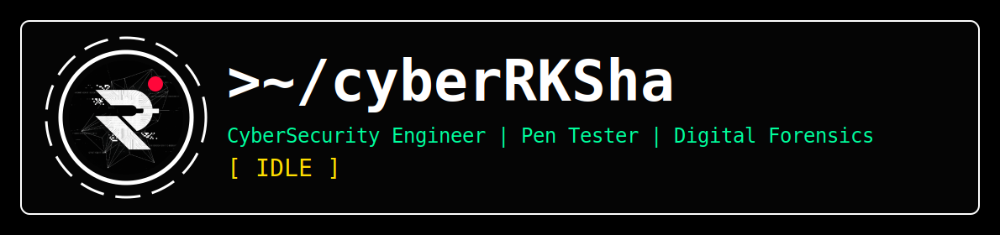

<p align="center">
  
</p>

<p align="center">


</p>

<p align="center">


</p>


## `> About Me`

```bash
┌──(cyberRKSha㉿github)-[~]
└─$ whoami

Name      :: RKSha
Role      :: Cybersecurity Enginner
Focus     :: Penetration Testing & Digital Forensics
Stack     :: Linux • Forensics • Bash • Networking
Status    :: Breaking | Learning | Building | Securing

ACCESS LVL: ROOT (Are you sure?)
```

## `> ls projects/`

<p align="center">
  <a href="https://github.com/cyberRKSha/LogRKSha">
    
  </a>
</p>


## `> ls tech_stack/`

<details>
<summary><b><code>[+] View Loaded Modules & Binaries</code></b></summary>

<br>
<p align="center">


<!-- Cybersecurity Tools -->


</p>
</details>

## `> cat learning.txt`

```yaml
- Advanced Networking
- Penetration Testing
- Linux Internals
- Digital Forensics
- Security Automation
```


## `> cat /var/log/telemetry.log`

<details>
<summary><b><code>[+] View GitHub Activity Metrics</code></b></summary>

<br>

<p align="center">

&nbsp;&nbsp;&nbsp;&nbsp;&nbsp;&nbsp;&nbsp;&nbsp;&nbsp;&nbsp;&nbsp;&nbsp;

</p>

<p align="center">

</p>

<p align="center">
  


</p>

</details>


## `> network_scan --connect`

<p align="center">

<a href="https://github.com/cyberRKSha">

</a>
&nbsp;&nbsp;&nbsp;&nbsp;&nbsp;&nbsp;&nbsp;&nbsp;&nbsp;&nbsp;&nbsp;&nbsp;
<a href="https://linkedin.com/in/rksha01">

</a>
&nbsp;&nbsp;&nbsp;&nbsp;&nbsp;&nbsp;&nbsp;&nbsp;&nbsp;&nbsp;&nbsp;&nbsp;
<a href="mailto:cyberrksha@gmail.com">

</a>

</p>

---

## `> achievements --badges`

<details>
<summary><b><code>[+] View Board</code></b></summary>

<br>

<p align="center">
  <a href="https://holopin.io/@rks">
    
  </a>
</p>

</details>


<details>
<summary><b><code>> quote.txt</code></b></summary>
<br>
  
```text
"Doubt everything."
                    — Unknown
```
</details>

```bash
┌──(visitor㉿github)-[~/]
└─$ exit

Bbie.
```

<p align="center">

</p>
